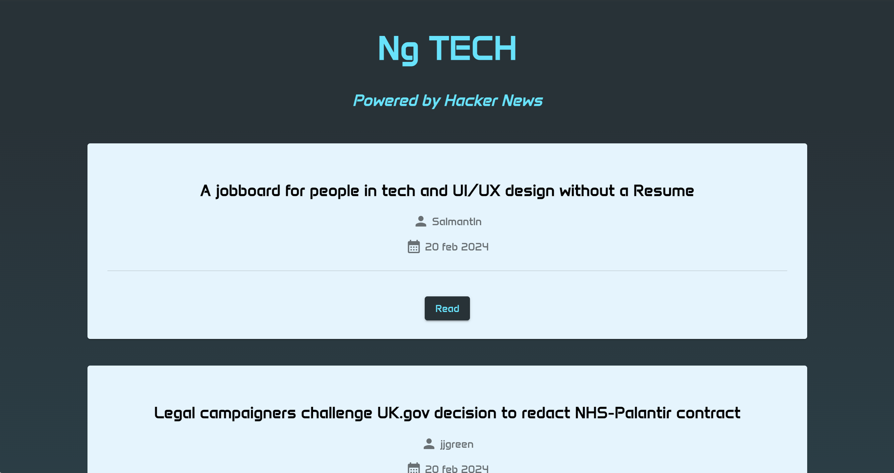

# Ng TECH


## Description
Ng TECH is a basic portal for tech news. It is powered by [Hacker News service](https://github.com/HackerNews/API), designed with Angular, HTML, CSS and Angular Material.



## Installation
If you're using OS X or Windows, use one of the installers from the [Node.js download page](https://nodejs.org/en/download/). LTS versions of Node.js are recommended.

Then, you can install the Angular CLI:
```bash
npm install -g @angular/cli
```

Now run `ng serve` for a dev server. Navigate to http://localhost:4200/. The application will automatically reload if you change any of the source files.

With `ng test` you can execute any unit test, and with `ng build` you can build your project for production.

## Usage
Use is really very easy, just open website and scroll down to see last news; for each one you can see title, reporter and date. The latest ten news will be displayed, if you want to see more, you can click on "LOAD MORE".


## Features
- Read always updated news
- Read up to 500 news
- Responsive design
- Powered by Hacker News

## Demo
You can try Ng TECH [here](https://ng-tech-d274a.web.app/).